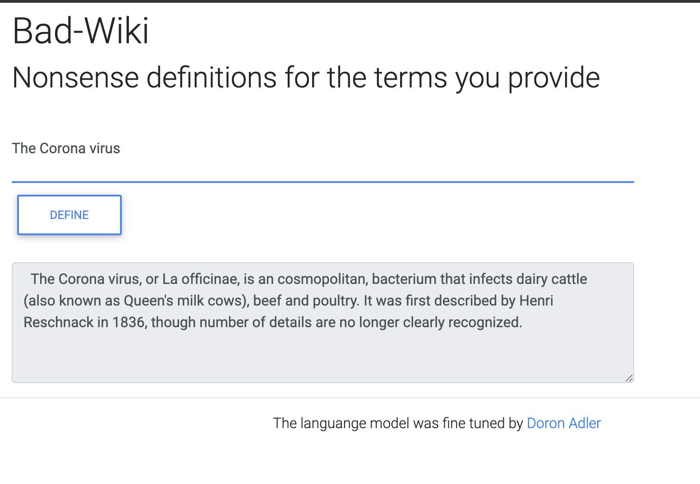

<h2 dir="ltr" class="my-5 mx-lg-5">
            <strong>gpt2-en-badwiki</strong>
        </h2>
        

 Bad-Wiki is an automatic text generator. It creates nonsense definitions for the terms you provide.

 

Demo is  <a href="https://badwiki.textgen.cloud">available here </a> - give it a try :) 

## Building from source

To get started on this project, follow these steps:

* Clone: `git clone https://github.com/Norod/gpt2-en-badwiki.git` and `cd gpt2-en-badwiki`
* Install Dependencies: `pip install -r requirements.txt`
* Run `download.sh` to download and extract the trained GPT-2 model
* Run server: `python main.py`
* Open Web Browser and visit: `http://localhost:8080/`
* Type `Hello world` and press on `Define` (or hit Enter)
* Enjoy!

You may also want to build and run this project in docker container

* Build: `docker build -t gpt2-en-badwiki .` (will take some time)
* Run: `docker run -p 8080:8080 --rm -d gpt2-en-badwiki`

If successful, you will see something like this:

## More information

This repository is based upon the code and knowlege found in the following Medium tutorial: [Deploy Machine Learning Model in Google Cloud using Cloud Run](https://medium.com/@NaxAlpha/deploy-machine-learning-model-in-google-cloud-using-cloud-run-6ced8ba52aac)
